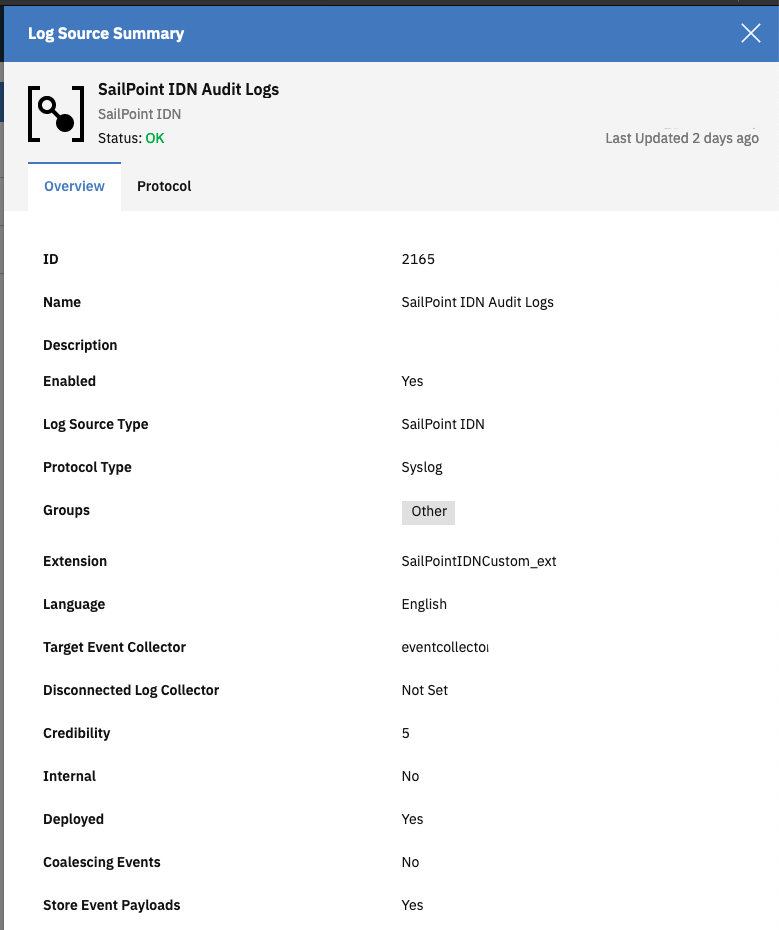

# IDN2QRadar

Scripting to send audit logs from SailPoint IDN to QRadar

## Project goal: 
Send SailPoint IdentityNow (IDN) Event logs to QRadar SIEM. Once the events are in QRadar we can  build rules that trigger offenses if undesired behavior is observed.

Currently there is no official integration of IDN with QRadar so a custom solution has to be built.

## High Level workflow:
* Periodically query the IDN Search API to retrieve  the latest event logs
* Forward the events as TCP Syslog messages to QRadar 
* Map events of custom log source so we can build rules triggering on certain event conditions


### Considerations:
* The search API allows querying events with filters e.g.  `created:>2021-02-28` but log events in the IDN API can become available with a slight delay. We have to build a mechanism that  queries  the latest events allowing for them to be delayed: `created:>{query_checkpoint_time} AND created:<{current_time - query_search_delay}`
* As seen above we need to record a checkpoint time that contains the last event that was retrieved from the API so we have a starting point for the next execution run. We store this value in  AWS System Manager Parameter store to keep state between executions.
* QRadar expects events from the same logsource from the same log source identifier (IP address) or will otherwise consider them to be distinct log sources. As we run the container in ECS every execution will have a different IP address assigned to the container. To allow QRadar to associate the events we will stream them through a NGINX proxy (hosted in EC2) so that the source IP is always the same.
* The event messages are encoded in JSON and transported via Syslog. This simplifies the event ID and event type mapping process in QRadar as we can simply parse JSON rather than Regex matching the relevant information in the payload.  
* UDP syslog messages should not exceed 1,024 bytes but SailPoint Logs are often >1,024 bytes and arrive truncated in QRadar. We use TCP Syslog instead.


Overview of  the AWS services  use in this solution
* [Amazon Elastic Container Service (ECS)](https://aws.amazon.com/ecs), a highly scalable, high performance container management service that supports Docker containers
* [AWS Fargate](https://aws.amazon.com/fargate) is a serverless compute engine for containers that works with ECS. Fargate removes the need to provision and manage servers, lets you specify resources per application, and improves security through application isolation by design.
* [AWS Systems Manager Parameter Store](https://docs.aws.amazon.com/systems-manager/latest/userguide/systems-manager-parameter-store.html) provides secure, hierarchical storage for configuration data management and secrets management as well as the ability to store values as plain text or encrypted data.
* Amazon Elastic Compute Cloud (Amazon EC2) is a web service that provides secure, resizable compute capacity in the cloud. 

### Prerequisites
* Docker : to build image that can be pushed to AWS Container Registry and run in  ECS

### How to deploy:

* Clone repo
* Populate `config.ini` with credentials and connection information
```bash
[qradar-syslog-server]
host = qradar-proxy.example.com
port = 514

[sailpoint.com]
client_id = REPLACE
client_secret = REPLACE
tenant = REPLACE 

[aws-parameter-store]
ACCESS_KEY = REPLACE
SECRET_KEY = REPLACE
```
* build docker container and push to Container registry:
```bash
docker build -t idn2qradar-ecs .
docker tag idn2qradar-ecs REPOSITORYID.dkr.ecr.eu-west-1.amazonaws.com/infosec
eval "$(aws ecr get-login --no-include-email --region eu-west-1)"
docker push  REPOSITORYID.dkr.ecr.eu-west-1.amazonaws.com/infosec
```
* Create a Scheduled Task in ECS to provision the container every 15 minutes 


### NGINX proxy 
To avoid having multiple log sources for the same type of events you can deploy an [NGINX stream proxy ](https://docs.nginx.com/nginx/admin-guide/load-balancer/tcp-udp-load-balancer/). Example configuration in `nginx.conf`

### QRadar Log source configuration
The  Log Source Extension becomes automatically available the moment you start to map events in the DSM editor. You need to then assign the custom extension to your custom log source and from that moment onwards the events will be parsed accordingly.



